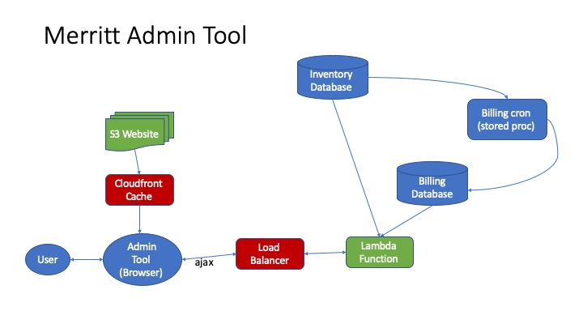

# Admin Lambda



This code contains a generalized query tool for the Merritt team.

This code will be deployed as an AWS Lambda that is accessible to staff from a static website deployed to S3.

The Lambda deployment will pull database credentials from AWS SSM.  SSM Parameters will be explicitly granted to the Lambda.  The lambda will be packaged as a docker image built from [cdluce3/mysql-ruby-lambda](mysql-ruby-lambda).

For testing purposes, another docker image will be run to simulate the ALB interface to the lambda.  See [cdluc3/simulate-lambda-alb](simulate-lambda-alb).  The files [docker-compose.yml](docker-compose.yml) and [admintool.yml](admintool.yml) will facilitate application testing.

The Lambda code is deployed to the Ruby 2.7 environment.  A build process is required to prepare a deployment zip file for Lambda.

## Directories
- mysql-ruby-lambda
  - base image for the lambda code
- simulate-lambda-alb
  - docker image to facilitate localhost testing with docker-compose
- src-admintool: Admintool Lambda source code
- src-colladmin: Collection Admin Lambda source code
- web: static website code to be deployed to S3

## Deployment Preparation
- This code relies on a set of SSM parameters to control the application.
- https://github.com/CDLUC3/uc3-aws-cli contains the code for reading Merritt SSM parameters.
- Lambda Image Push/Deploy variables
  - ../admintool/lambda-arn-base - arn for the function
  - ../admintool/merritt-path - Merritt system URL (for hyperlinks)
  - ../admintool/ecr-registry - AWS ECR Registry name
  - ../admintool/ecr-image - Name of image to be published to the registry
- Static Website variables
  - ../admintool/api-path - api gateway path (or cloudfront path)
  - ../admintool/s3-bucket - Website S3 bucket
  - ../admintool/s3-path - Website path in S3
  - ../admintool/site-url - CloudFront website

### Deploy the Lambda Code

The following script should be run from a host that is authorized to 
- push to ECR
- deploy to Lambda.

Deploy Scripts
- Admin Tool: [lambda-deploy.sh](lambda-deploy.sh)
- Collection Admin Tool: [colladmin-lambda-deploy.sh](colladmin-lambda-deploy.sh)

This will build a docker image, push it to ECR, and update lambda to use the new image.

This script requires SSM parameters to be configured.  Requires lambda update function permissions.

This script **requires aws cli V2** in order to deploy a docker image to lambda.  
- The host running this script needs to be able to push to ECR and to update a lambda.

## Static Website Publishing
- A static website provides the user interface for these queries.
- On page load, URL parameters are read to determine the query to run
- A query request is made via ajax
- Query results are reformatted into an html table and displayed to the user  
- A publishing script [publish.sh](publish.sh) will copy assets into an S3 bucket
- AWS Cloud Front has been configured to provide a URL for the static website
  - Cloud Front is also used to restrict access to the website

## Local Testing

### Placeholder Lambda Testing
- Home page: [simulate-lambda-alb/web/index.html](simulate-lambda-alb/web/index.html)
- Lambda entrypoint: [simulate-lambda-alb/alb_simulate.rb](simulate-lambda-alb/alb_simulate.rb)
- Lambda Dockerfile: [simulate-lambda-alb/Dockerfile](simulate-lambda-alb/Dockerfile)

```
docker-compose -f docker-compose.yml up -d
```

### Admin Tool (from server with SSM)
- Home page: [web/index.html](web/index.html)
- Lambda entrypoint: [src-admintool/lambda_function.rb](src-admintool/lambda_function.rb)
- Lambda Dockerfile: [src-admintool/Dockerfile](src-admintool/Dockerfile)
```
docker-compose -f docker-compose.yml -f admintool.yml up -d
```

### Collection Admin Tool (from server with SSM)
- Home page: [web/collAdmin.html](web/collAdmin.html)
- Lambda entrypoint: [src-colladmin/lambda_function.rb](src-colladmin/lambda_function.rb)
- Lambda Dockerfile: [src-colladmin/Dockerfile](src-colladmin/Dockerfile)
```
docker-compose -f docker-compose.yml -f colladmin.yml up -d
```

### Collection Admin Tool (from desktop without SSM)
```
docker-compose -f docker-compose.yml -f colladmin.yml -f local.yml up -d
```

Open the following URL to test.

- [http://localhost:8091/web/index.html](http://localhost:8091/web/index.html)
- [http://localhost:8091/web/collAdmin.html](http://localhost:8091/web/collAdmin.html)
