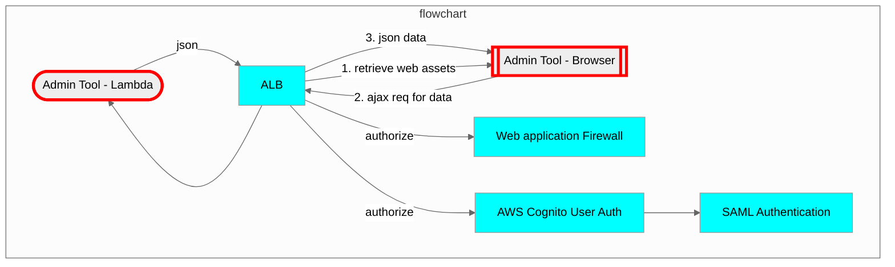
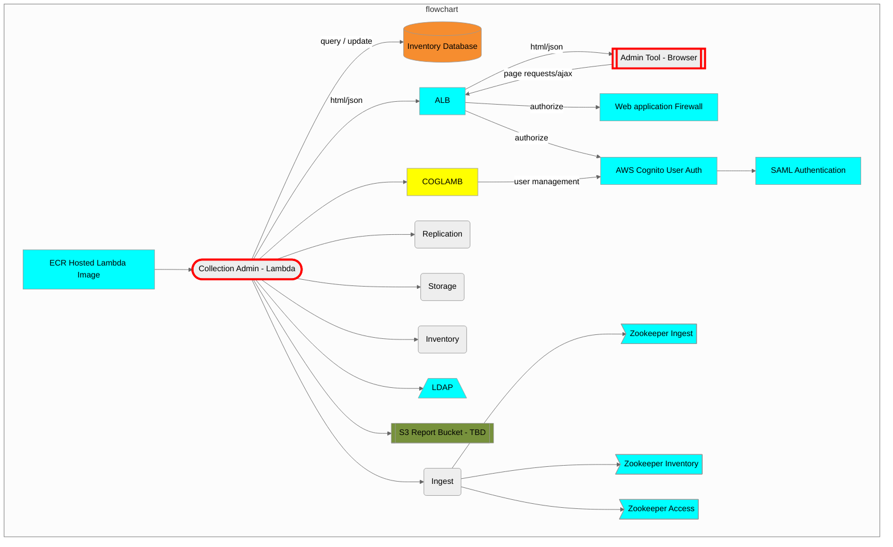

# Merritt Admin Tool

This library is part of the [Merritt Preservation System](https://github.com/CDLUC3/mrt-doc).

## Admin Tool Web Interface  
Each Admin Lambda application functions as a simple web server displaying the pages for the application.



## Admin Tool Lambda
This code contains a generalized query tool for the Merritt team.


## Collection Admin Tool



The Lambda deployment will pull database credentials from AWS SSM.  SSM Parameters will be explicitly granted to the Lambda.  The lambda will be packaged as a docker image built from [mysql-ruby-lambda](mysql-ruby-lambda).


The Lambda code is deployed to the Ruby 2.7 environment.  A build process is required to prepare a deployment zip file for Lambda.

## Directories
- mysql-ruby-lambda
  - base image for the lambda code
- src-admintool: Admintool Lambda source code
- src-colladmin: Collection Admin Lambda source code
- src-common: Code common to both Admin Tool and CollAdmin Tool
  - web: web resources served from the lambda

## Code Preparation

Install Gems, Update Gems, Lint all code directories.
```bash
run_bundle.sh
```

## Deployment Preparation
- This code relies on a set of SSM parameters to control the application.
- https://github.com/CDLUC3/uc3-aws-cli contains the code for reading Merritt SSM parameters.
- Lambda Image Push/Deploy variables

### Deploy the Lambda Code

The following script should be run from a host that is authorized to 
- push to ECR
- deploy to Lambda.

### Config Scripts
- Admin Tool: [lambda-config.sh](lambda-config.sh)
- Collection Admin Tool: [colladmin-lambda-config.sh](colladmin-lambda-config.sh)


### Build and Deploy Scripts
- Admin Tool: [lambda-deploy.sh](lambda-deploy.sh)
- Collection Admin Tool: [colladmin-lambda-deploy.sh](colladmin-lambda-deploy.sh)

This will build a docker image, push it to ECR, and update lambda to use the new image.

This script requires SSM parameters to be configured.  Requires lambda update function permissions.

This script **requires aws cli V2** in order to deploy a docker image to lambda.  
- The host running this script needs to be able to push to ECR and to update a lambda.

### Cross-account ECR Deploy Scripts
- Admin Tool: [lambda-tagdeploy.sh](lambda-tagdeploy.sh)
- Collection Admin Tool: [colladmin-lambda-dtagdeployeploy.sh](colladmin-lambda-tagdeploy.sh)


## Automated Testing

This may be performed from a DEV box against Stage instances.

```
cd src-testdriver
bundle exec rspec
```
