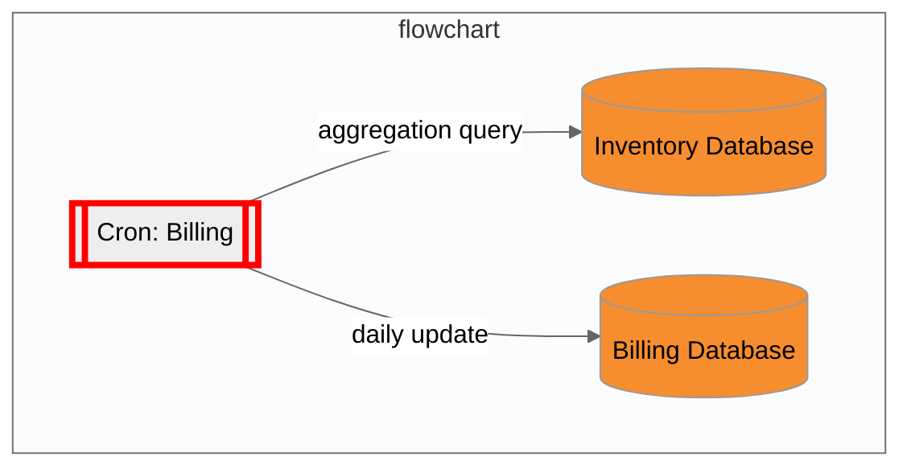

# Merritt Billing

> [!NOTE]
> When the mrt-admin-lambda project is archived, the billing schema/views/sps should be maintained in 
> https://github.com/CDLUC3/merritt-docker/blob/main/mrt-services/mysql/init.sql



The Merritt Billing database has 2 purposes.
- Support Merritt Invoice generation
- Support Merritt Admin Tool queries

The Merritt Billing database is updated once a day with data aggregated from the Merritt Inventory database.

## Billing Database Tables
- See [schema.sql](sql/schema.sql)

## Billing Database Views - Optimized for Report Generation
- See [views.sql](sql/views.sql)
- These views are utilized in the following queries: https://github.com/CDLUC3/mrt-admin-proto/blob/master/app/controllers/query_controller.rb

## Daily Migration Process Stored Procedures

- See [migrate.sql](sql/migrate.sql)

## Daily Cron
```
#!/bin/bash

${HOME}/bin/uc3-mysql.sh billing -- -e 'call update_billing_range();'
${HOME}/bin/uc3-mysql.sh billing -- -e 'call update_object_size();'
${HOME}/bin/uc3-mysql.sh billing -- -e 'call update_audits_processed();'
${HOME}/bin/uc3-mysql.sh billing -- -e 'call update_ingests_processed();'
```